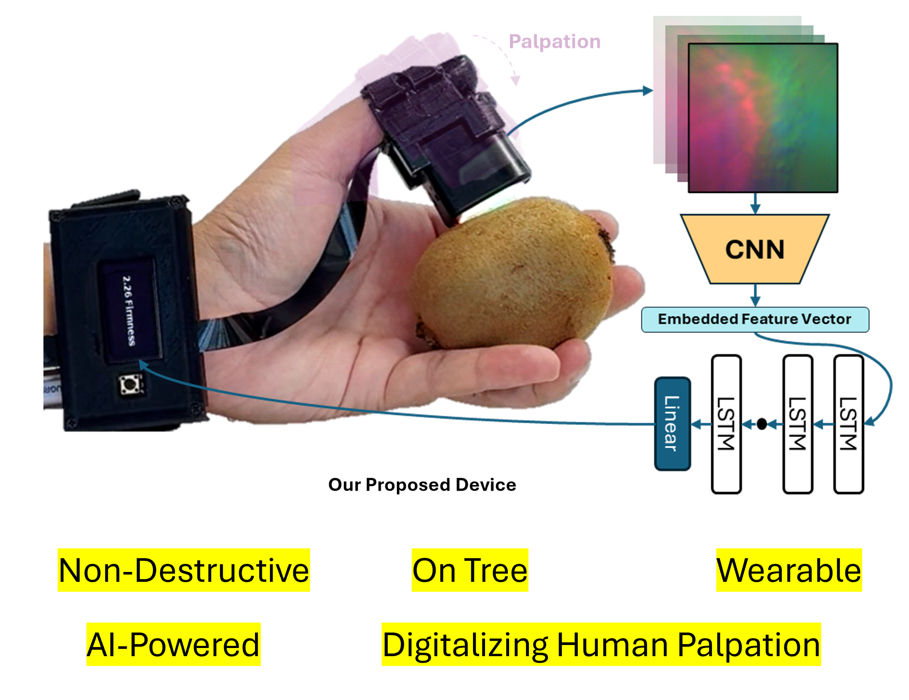

<h1 align="center">
  
   &nbsp;&nbsp;
   &nbsp;&nbsp;
  
  <br/>
</h1>

<h2 align="center">
A Wearable Thumb Device for Fruit Firmness Estimation with Vision-Based Tactile Sensing
</h2>

<p align="center">
  <a href="https://mashood3624.github.io/WearableDevice/"><b>Project Website</b></a> •
  <a href="https://mashood3624.github.io/WearableDevice/paper.pdf"><b>Paper</b></a> •
  <a href="https://doi.org/10.1016/j.compag.2025.110593"><b>DOI</b></a> •
  <a href="https://youtu.be/MaLs7fFNrok?si=vRf5nCoIOY40dm-0"><b>Video</b></a>
</p>

<p align="center">
   
   <a href="https://creativecommons.org/licenses/by-nc-nd/4.0/"><b>License: CC BY-NC-ND 4.0</b></a> 

</p>

<p align="center">
  
</p>

<div align="center">
  
</div>

The proposed wearable device for real-time, and non-destructive fruit firmness estimation. The user palpates a Kiwi, and the proposed model processes the VBTS palpation recording to predict firmness in a non-destructive approach.

---

# Code & Dataset will be uploaded soon

## Demonstration of On-Tree Firmness Estimation

<div align="Center">
  
</div>

## Our Related work 

This project builds on our prior research in tactile sensing and fruit firmness estimation. For further exploration of our methods and insights, refer to:

- [SwishFormer for robust firmness and ripeness recognition of fruits using visual tactile imagery (Postharvest Biology and Technology, 2025)](https://doi.org/10.1016/j.postharvbio.2025.113487): Robot palpation-based fruit sorting is performed using the proposed SwishFormer algorithm, which processes vision-based tactile sequences via a hardswish-activated transformer and Random Forest regressor. The system achieves a 96.6–98.3% ripeness classification success and up to 13.69% R² improvement with 2× fewer parameters than prior models.
- [Soft Vision-Based Tactile-Enabled SixthFinger: Advancing Daily Objects Manipulation for Stroke Survivors (RoboSoft, 2025)](https://arxiv.org/abs/2501.06806): Presents a soft robotic finger with integrated vision-based tactile sensing for autonomous grip adjustment via slippage detection. A transformer-based model trained on diverse tactile data enables robust object manipulation for stroke survivors across varied real-world tasks.
- [Cross-Modal Knowledge Distillation for Efficient Material Recognition: Aligning Language Descriptions with Tactile Image Models (IEEE IROS WorkShop BoB, 2024)](https://openreview.net/forum?id=EKYZaxzvae): Aligning Language Descriptions with Tactile Image Models (IEEE IROS WorkShop BoB, 2024): Proposes a cross-modal distillation framework where a BART language model transfers semantic knowledge to a ViT-based tactile image model for material recognition. The distilled ViT achieves 74.70% accuracy (↑16.87%) and is validated through real-world UR10 robot experiments.

We encourage readers to explore these works for deeper technical context and complementary advancements.

## Acknowledgements
This publication is based upon work supported by the Khalifa University of Science and Technology under Award No. RC1-2018-KUCARS. 
Some elements of this project's README design were adapted from <a href="https://github.com/rpl-cmu/YCB-Slide"><b>YCB-Slide</b></a>.
The website was built using  <a href="https://github.com/RomanHauksson/academic-project-astro-template"><b>Roman Hauksson's</b></a> academic project page template.

## Bibtex
```
@article{MOHSAN2025110593,
title = {A wearable thumb device for fruit firmness estimation with vision-based tactile sensing},
journal = {Computers and Electronics in Agriculture},
volume = {237},
pages = {110593},
year = {2025},
issn = {0168-1699},
doi = {https://doi.org/10.1016/j.compag.2025.110593},
url = {https://www.sciencedirect.com/science/article/pii/S0168169925006994},
author = {Mashood M. Mohsan and Basma B. Hasanen and Taimur Hassan and Lakmal Seneviratne and Irfan Hussain}
}
```

