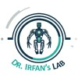
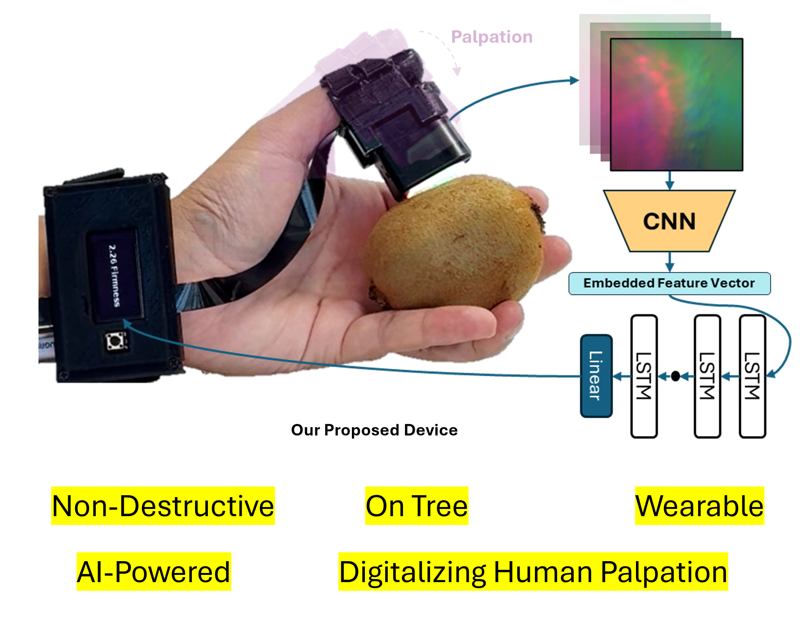

<h1 align="center">
  
   &nbsp;&nbsp;
   &nbsp;&nbsp;
  
  <br/>
</h1>

<h2 align="center">
A Wearable Thumb Device for Fruit Firmness Estimation with Vision-Based Tactile Sensing
</h2>

<p align="center">
  <a href="https://mashood3624.github.io/WearableDevice/"><b>Project Website</b></a> •
  <a href="https://www.sciencedirect.com/science/article/pii/S0925521425000997"><b>Paper</b></a> •
  <a href="https://1drv.ms/u/s!ApqqDy-MtRnr7ZNqhgBw2g6snSRObA?e=B8JfiM"><b>Dataset</b></a> •
  <a href="https://www.youtube.com/watch?v=rfSmYwNcWEg"><b>Video</b></a>
</p>

<p align="center">
  
</p>

<p align="center">
  
</p>

<div align="center">
  
</div>

The proposed wearable device for real-time, and non-destructive fruit firmness estimation. The user palpates a Kiwi, and the proposed model processes the VBTS palpation recording to predict firmness in a non-destructive approach.

---

## Setup

### 1. Clone repository
```bash
git clone git@github.com:Mashood3624/WearableDevice.git
```

### 2. Download dataset & weights
Please download the dataset and weights by clicking <a href="https://1drv.ms/u/s!ApqqDy-MtRnr8It_bNxLJskhrAx3SA?e=OlfotV"><b>here</b></a>. Please reach out at <a href="https://www.linkedin.com/in/mashood3624/"><b>LinkedIn</b></a> in case of any issues.

### 3. Folder structure
```bash
WearableDevice
├── configs                            # Folder contains training configuration
    ├── config_001.json 
├── dataset                            
    ├── Sample_001                     # Palpation recording
    ├── dataset.csv                    # CSV dataset consist of firmness values to crossponding recordings
├── weights                            
    ├── exp_001                        # Consist weights of trained model
    ├── cnn_backbone.safetensors       # Pretrained ResNet Tactile Encoder weights
├── model                              
    ├──model_CNN_LSTM.py               # CNN LSTM source code
├── utilities                          
    ├── data.py                        # Dataset loader source code                
    ├── utils.py                       # Utilities source code
├── .py files                          # Rest of the files in this repo
```

### 4. Setup WearableDevice conda env
```bash
cd WearableDevice
conda env create -f env.yml
conda activate WearableDevice
```

### 5. Train Model
```bash
python main.py ./configs/config_001.json

```

### 6. Demonstration of On-Tree Firmness Estimation

<div align="Center">
    <h3>Fruit Sorting using SwishFormer </h3>
  
</div>

## Our Related work 

This project builds on our prior research in tactile sensing and fruit firmness estimation. For further exploration of our methods and insights, refer to:

- [SwishFormer for robust firmness and ripeness recognition of fruits using visual tactile imagery (Postharvest Biology and Technology, 2025)](https://doi.org/10.1016/j.postharvbio.2025.113487)
- [Soft Vision-Based Tactile-Enabled SixthFinger: Advancing Daily Objects Manipulation for Stroke Survivors (RoboSoft, 2025)](https://arxiv.org/abs/2501.06806)
- [Cross-Modal Knowledge Distillation for Efficient Material Recognition: Aligning Language Descriptions with Tactile Image Models (IEEE IROS WorkShop BoB, 2024)](https://openreview.net/forum?id=EKYZaxzvae)

We encourage readers to explore these works for deeper technical context and complementary advancements.

## Acknowledgements
This publication is based upon work supported by the Khalifa University of Science and Technology under Award No. RC1-2018-KUCARS. 
Some elements of this project's README design were adapted from <a href="https://github.com/rpl-cmu/YCB-Slide"><b>YCB-Slide</b></a>.
The website was built using  <a href="https://github.com/RomanHauksson/academic-project-astro-template"><b>Roman Hauksson's</b></a> academic project page template.

## Bibtex
```
@article{mohsan2025swishformer,
      title={SwishFormer for robust firmness and ripeness recognition of fruits using visual tactile imagery},
      author={Mohsan, Mashood M and Hasanen, Basma B and Hassan, Taimur and Din, Muhayy Ud and Werghi, Naoufel and Seneviratne, Lakmal and Hussain, Irfan},
      journal={Postharvest Biology and Technology},
      volume={225},
      pages={113487},
      year={2025},
      publisher={Elsevier}
    }
```

